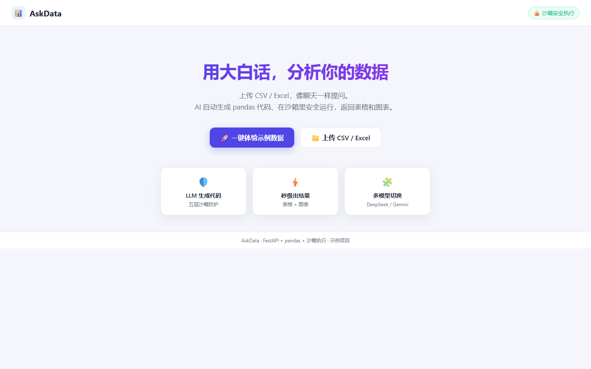
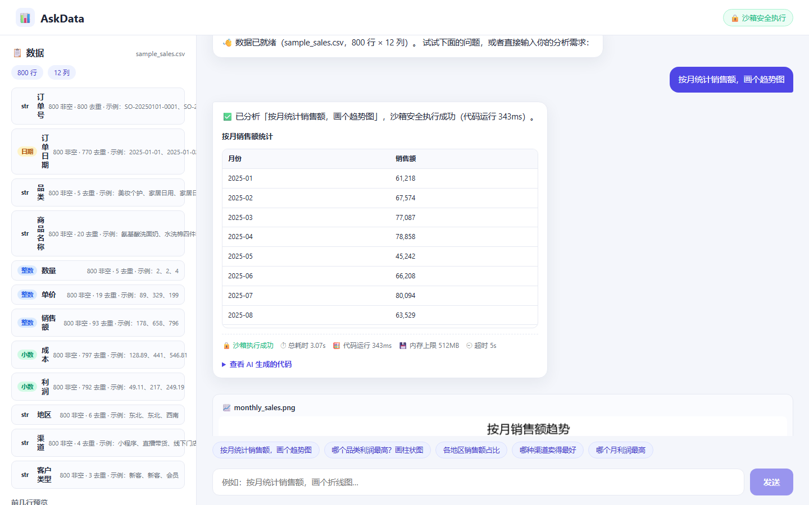

# 📊 AskData · 自然语言数据分析助手

上传一个 CSV / Excel，用大白话提问（「按月统计销售额」「哪个品类最赚钱，画个柱状图」），AI 自动生成 pandas 代码，在**安全沙箱**中执行，返回表格和图表。

> 🌐 在线体验：**（部署后把链接贴在这里）** —— 参见[部署指南](#部署)（Hugging Face Spaces / Render 免费方案，约 5 分钟）

---

## ✨ 项目亮点（面试重点）

1. **「LLM 生成代码 → 沙箱安全执行」完整链路**：不是简单调 API 返回文字，而是把自然语言转成真实可运行的 pandas 代码，在受限子进程中执行，再把结构化结果（表格 / 图表 / 文本）送回前端渲染。
2. **防止模型生成危险代码的纵深防御**：AST 静态扫描 → 独立子进程（`-I` 隔离模式）→ 运行时护栏（白名单导入 + 传递性危险模块拦截 / 断网 / 文件读写限制 / 禁用危险内建 / 运行时 getattr 守卫）→ 5 秒超时强杀 → 内存上限（Linux rlimit + 跨平台 psutil 看门狗）。针对 `__globals__` / `__subclasses__` / `numpy.ctypeslib` 传递性 `ctypes` 三类真实逃逸向量有专门回归测试。
3. **可点开即用的在线演示**：预置 800 行电商销售示例数据，「一键体验」无需上传即可看到完整效果。
4. **模型可插拔**：DeepSeek / Gemini / 任意 OpenAI 兼容接口统一走 openai SDK，切换只改一个环境变量；无 Key 时自动降级为 mock 演示模式。

部署后访问 `https://你的空间地址/?demo=1` 即可自动加载示例数据并完成一次完整问答（适合放进简历和给面试官现场演示）。

---

## 🏗 架构

```
┌─────────────┐   上传/示例数据   ┌──────────────────┐
│  前端页面    │ ───────────────▶ │  FastAPI 后端     │
│ (原生 JS +   │ ◀─────────────── │  会话管理/预览     │
│  plotly.js)  │  表格/图表/代码   └────────┬─────────┘
└─────────────┘                            │ 问题 + 数据概览
                                           ▼
                                   ┌──────────────────┐
                                   │  LLM（DeepSeek /  │
                                   │  Gemini / mock）  │
                                   └────────┬─────────┘
                                            │ 生成的代码
                                            ▼
                                   ┌──────────────────┐
                                   │  沙箱执行器        │
                                   │  subprocess 隔离   │
                                   │  超时/内存/断网/   │
                                   │  白名单/文件限制    │
                                   └────────┬─────────┘
                                            │ 结果 JSON + 图表
                                            ▼
                                   ┌──────────────────┐
                                   │  pandas / matplotlib / plotly │
                                   └──────────────────┘
```

**数据流**：上传文件 → 后端解析并生成字段概览（类型 / 非空 / 去重 / 示例值）→ 连同用户问题发给 LLM → 得到纯 pandas 代码 → 沙箱执行 → 结构化结果（`save_result` / `save_chart` 协议）→ 前端渲染表格、图表与可展开的代码。

---

## 🛡 沙箱安全设计（本项目核心）

> **为什么不能在公开服务器上直接 `exec` LLM 生成的代码？**
> 模型可能被提示注入诱导生成 `os.system`、读写服务器文件、发请求外带数据等危险代码。直接在主进程执行 = 一句话拿下服务器。本项目把它放进**独立子进程**，并叠加五层防护：

| 层 | 防护 | 实现 |
|----|------|------|
| 1 | **AST 静态扫描** | 先解析代码，拒绝危险导入（os/subprocess/socket…）、`exec/eval/open/input`、`__subclasses__`/`__globals__` 等逃逸属性，直接返回「代码未通过安全检查」 |
| 2 | **独立子进程隔离** | `subprocess.Popen` + Python `-I` 隔离模式，独立临时目录运行，与主服务进程隔离；Linux 下同时设 rlimit |
| 3 | **运行时护栏** | 自定义 `__import__` 白名单（只放行 pandas/numpy/matplotlib/plotly 等）；`ctypes`/`subprocess`/`importlib`/`pickle`/`marshal` 等危险模块**对所有调用方**一律拦截（含库内部传递性 import）；`getattr` 守卫拦下 `__globals__`/`__subclasses__`/`__mro__` 等 dunder 逃逸；`socket` 关键入口全部替换为抛错（断网）；`open()` 限制只能读写沙箱临时目录；禁 `exec/eval/compile/input`；patch `os.system/popen/spawn/exec*` |
| 4 | **超时强杀** | 等子进程打印 `READY`（依赖加载完成）后才开始计时，**5 秒只算用户代码执行时间**；超时杀整个进程树 |
| 5 | **内存上限** | Linux 用 `RLIMIT_AS` 硬限制；全平台用 psutil 看门狗每 100ms 轮询 RSS（含子进程树），超限即杀 |

### 结果协议（也是防注入的一部分）

提示词要求模型通过两个助手函数输出，而不是自由 print：

- `save_result(结果, "描述")`：注册 DataFrame / Series / 标量 → 自动转成 JSON 表格；
- `save_chart(name=...)` / `save_chart(fig, name=...)`：保存 matplotlib PNG 或 plotly JSON。

这样沙箱产出是**结构化、可校验**的，前端只渲染这些数据，不执行任何模型产出的脚本。

### 威胁模型与诚实边界

本项目沙箱的定位要诚实：它是**防失控 / 防误操作的纵深防御**，不是对恶意攻击者的「硬安全边界」。Python 在进程内做不到绝对沙箱（语言特性决定），尤其当你需要暴露 pandas / numpy / matplotlib / plotly 这些库时。

**它能防住的：**

- 模型生成危险代码导致的服务崩溃或资源耗尽（死循环超时、内存爆、无限递归）
- 误写沙箱目录之外的文件、误发网络请求
- 直接的 `os.system` / `subprocess` / `exec` / `eval` / 危险导入

**它防不住 / 不保证的：**

- 专门研究 Python 沙箱逃逸、愿意花时间构造复杂 payload 的攻击者。进程内沙箱始终存在「通过库内部对象回溯到 `os`/`sys`」这类理论逃逸面，这是 Python 沙箱的客观边界。

**开发时实际发现并修复过的逃逸向量（均有回归测试）：**

1. `func.__globals__` 泄漏：经 `save_result.__globals__` 拿到 runner 模块的原始 `__import__` / `open` → 已改为给助手函数重挂最小化 `__globals__`，并加运行时 `getattr` 守卫拦截 dunder 属性。
2. `getattr(object, "__subclasses__")` 经典逃逸 → 运行时 `getattr` 守卫拦截。
3. 合法导入 `numpy.ctypeslib` 传递性带出 `ctypes` → 对 `ctypes`/`subprocess`/`importlib`/`pickle`/`marshal` 等危险模块**对所有调用方**一律拦截。

**生产部署的正确姿势**：公开服务要真正隔离「执行 LLM 生成代码」这一步，应把它放进独立容器 / gVisor / seccomp / firejail 的系统级沙箱（进程内沙箱只作为第一层快筛）。仓库附带非 root 的 `Dockerfile` 与加固版 `docker-compose.yml`（去能力、只读根文件系统、资源上限），用于限制爆炸半径。

---

## ✅ 功能

- 上传 CSV / Excel（自动识别 utf-8 / gbk 编码），预览前 10 行 + 字段类型 / 非空 / 去重统计
- 聊天式提问：AI 生成 pandas 代码 → 沙箱执行 → 返回表格 + matplotlib / plotly 图表
- 预置电商销售示例数据（800 行），「一键体验」立即看到效果
- 前端展示生成的代码（可展开）、沙箱执行指标（耗时 / 内存上限 / 超时）
- 会话级图表持久化（`/media/...`），无需数据库即可跑通 MVP

### 界面预览

| 落地页 | 问答工作区 |
|--------|-----------|
|  |  |

---

## 🚀 快速开始

```bash
git clone <your-repo-url> && cd AskData
python -m venv .venv
source .venv/bin/activate          # Windows: .venv\Scripts\activate
pip install -r requirements.txt

# 不配置 LLM 时默认 mock 模式（示例数据 + 预设问题可完整体验）
uvicorn app.main:app --reload --port 8000
```

打开 http://127.0.0.1:8000 ，点「🚀 一键体验示例数据」即可。

Windows 用户也可以直接双击 `run.bat`（自动创建 venv 并安装依赖）。

---

## 🔑 接入真实 LLM（任选其一，均走 OpenAI 兼容接口）

### DeepSeek（推荐，便宜）

```bash
export ASKDATA_LLM_PROVIDER=deepseek
export ASKDATA_LLM_API_KEY=sk-xxxx
```

### Gemini（免费额度）

```bash
export ASKDATA_LLM_PROVIDER=gemini
export ASKDATA_LLM_API_KEY=AIza...
```

### 任意 OpenAI 兼容接口

```bash
export ASKDATA_LLM_PROVIDER=openai
export ASKDATA_LLM_BASE_URL=https://your-endpoint/v1
export ASKDATA_LLM_MODEL=your-model
```

完整变量见 [.env.example](.env.example)：超时、内存上限、上传大小、会话 TTL 均可调。

---

## 📡 API

| 方法 | 路径 | 说明 |
|------|------|------|
| GET | `/api/health` | 健康检查 + 当前配置 |
| POST | `/api/upload` | 上传 CSV/Excel，返回会话 + 预览 + 字段概览 |
| POST | `/api/sample` | 一键加载示例数据 |
| POST | `/api/ask` | `{session_id, question}` → 结果表格 + 图表 URL + 代码 + 沙箱指标 |

---

## 🧪 测试

```bash
pip install -r requirements-dev.txt
pytest -v
```

覆盖：合法代码执行、危险导入拦截、运行时导入绕过拦截、文件逃逸拦截、死循环超时、内存超限强杀，以及针对三类真实沙箱逃逸（`__globals__` 泄漏、`getattr(__subclasses__)`、`numpy.ctypeslib` 传递性 `ctypes`）的回归测试；另有上传 / 示例 / 问答全链路 API 测试。

---

## ☁️ 部署（免费）

### Hugging Face Spaces（Docker）

1. 把仓库推送到 GitHub；
2. 在 huggingface.co/spaces 新建 Space → SDK 选 **Docker** → 关联仓库；
3. Settings → Variables and Secrets 里配置 `ASKDATA_LLM_PROVIDER` / `ASKDATA_LLM_API_KEY`；
4. 启动后把 Space 地址贴到本 README 顶部「在线体验」。

### Render（Web Service）

1. New Web Service → 关联仓库；
2. Build Command：`pip install -r requirements.txt`；
3. Start Command：`uvicorn app.main:app --host 0.0.0.0 --port $PORT`；
4. Environment 里配置 LLM 变量。

### Docker Compose（本地 / 任意 VPS）

```bash
docker compose up --build
```

使用加固版 `docker-compose.yml`：非 root、`no-new-privileges`、`cap_drop: ALL`、只读根文件系统（数据目录走命名卷）、内存 / CPU / PID 上限。适合本地一键起，或部署到自己的 VPS。

---

## 📁 项目结构

```
AskData/
├── app/
│   ├── main.py            # FastAPI 入口：上传/示例/问答
│   ├── sandbox.py         # 沙箱编排：静态扫描 + 子进程 + 超时/内存看门狗
│   ├── sandbox_runner.py  # 沙箱执行器（子进程侧）：运行时护栏 + 结果协议
│   ├── llm.py             # DeepSeek/Gemini/OpenAI 兼容 + mock 模式
│   ├── prompts.py         # 提示词：安全编码协议
│   ├── data_loader.py     # CSV/Excel 解析、字段推断、预览
│   ├── sample_data.py     # 示例电商销售数据生成
│   └── sessions.py        # 内存会话管理（含过期清理）
├── static/                # 原生 JS 前端（无框架依赖）
├── tests/                 # 沙箱安全 + API 集成测试
├── Dockerfile             # 非 root 用户运行
├── docker-compose.yml     # 加固编排：去能力 / 只读根文件系统 / 资源上限
└── requirements.txt
```

---

## 🗺 Roadmap

- [ ] LLM 二次调用：根据结果生成一句话结论（多轮对话）
- [ ] 支持多文件关联查询（join）
- [ ] Docker 部署模板升级为 gVisor / seccomp 系统级隔离
- [ ] 自动生成分析报告（Markdown / PDF 导出）

---

**AskData** — 用大白话，分析你的数据。Made with FastAPI + pandas + 一颗敬畏安全的心。
